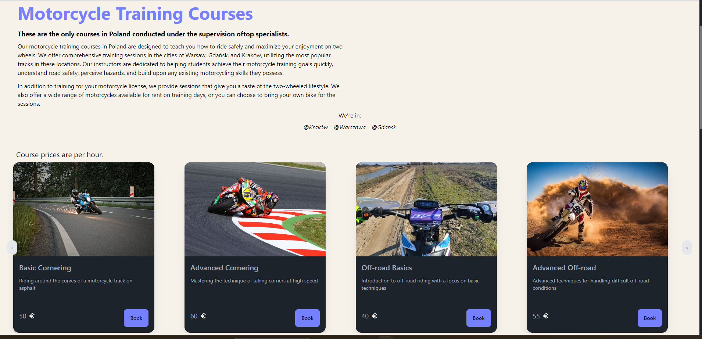
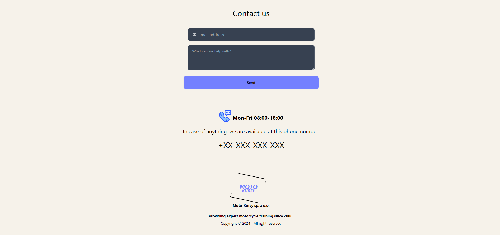
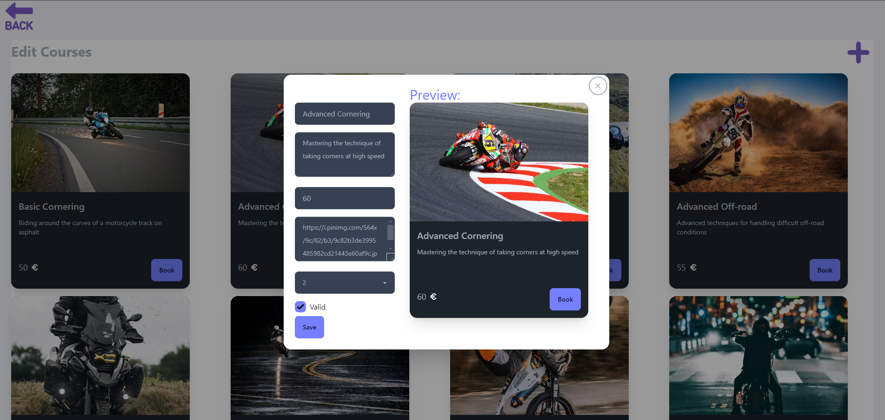
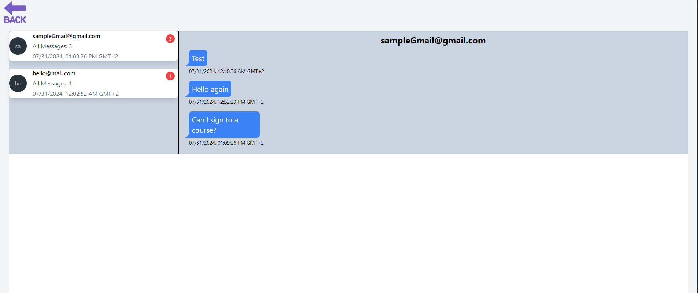

# Moto-Kursy

A simple skeleton of a website offering motorcycle training courses.

The project is built with React and Nest.js, using a PostgreSQL database.

### Admin Panel

You can go to /admin ednpoint to see the admin panel
Password and Login are in user.service.ts file on backend side

[Go to Images](#screenshots)

### Prerequisites

- Node.js version: 22.5.1

### How to Run the Project

#### Backend

To run the backend server in a Docker container in development mode along with a PostgreSQL database, follow these steps:

1. Open a terminal in the project's root directory.
2. Navigate to the backend directory:
   ```sh
   cd backend
   ```
3. Build and start the Docker containers:
   ```sh
   docker compose up --build
   ```

#### Frontend

To run the frontend server in development mode, follow these steps:

1. Open a terminal in the project's root directory.
2. Navigate to the frontend directory
   ```sh
   cd frontend
   ```
3. Start the development server:
   ```sh
   npm run dev
   ```

This will start the backend server in a Docker container and the frontend server in development mode.

### Importing PostgreSQL Data

To import the provided database dump into your PostgreSQL container:

1. **Start Your PostgreSQL Container:**:
   If you haven't already, start your PostgreSQL container using Docker Compose or the Docker CLI.
   ```sh
   docker-compose up -d
   ```
2. **Copy the Dump File to the Container:**
   Place the dump.sql file in the same directory as your docker-compose.yml file. Then run the following command to copy the dump file into the container:

   ```sh
   docker cp dump.sql <container_id>:/dump.sql
   ```

   Replace <container_id> with the ID of your PostgreSQL container.

3. **Import the Data:**
   Execute the following command to import the data into your PostgreSQL container:

   ```sh
   docker exec -i <container_id> psql -U /username/ -d <database_name> -f /dump.sql
   ```

   Replace <container_id>, /username/ and <database_name> with the appropriate values.

### Polish Version

# Moto-Kursy

Prosty szkielet strony oferującej kursy doszkalające na motocyklu.

Projekt powstał z użyciem Reacta i Nest.js oraz bazy danych PostgreSQL.

### Panel Admina

Możesz przejść do endpointu /admin aby zobaczyć panel admina
Hasło i Login są w pliku user.service.ts po stronie backendu

### Wymagania

- Wersja Node.js: 22.5.1

### Jak uruchomić projekt

#### Backend

Aby uruchomić serwer backendowy w kontenerze Docker w trybie developerskim wraz z bazą danych PostgreSQL, wykonaj następujące kroki:

1. Otwórz terminal w katalogu głównym projektu.
2. Przejdź do katalogu backend:
   ```sh
   cd backend
   ```
3. Zbuduj i uruchom kontenery Docker:
   ```sh
   docker-compose up --build
   ```

#### Frontend

Aby uruchomić serwer frontendowy w trybie developerskim, wykonaj następujące kroki:

1. Otwórz terminal w katalogu głównym projektu.
2. Przejdź do katalogu frontend
   ```sh
   cd frontend
   ```
3. Uruchom serwer developerski
   ```sh
   npm run dev
   ```

To uruchomi serwer backendowy w kontenerze Docker oraz serwer frontendowy w trybie developerskim.

### Importowanie danych z PostgreSQL

Aby zaimportować dump bazy danych do kontenera PostgreSQL:

1. **Uruchom kontener postgresa:**:
   Jeśli jeszcze tego nie zrobiłeś, uruchom kontener PostgreSQL za pomocą Docker Compose lub interfejsu wiersza polecenia Docker.
   ```sh
   docker-compose up -d
   ```
2. **Skopiuj Plik Dump do kontenera:**
   Umieść plik dump.sql w tym samym katalogu, w którym znajduje się plik docker-compose.yml. Następnie uruchom następujące polecenie, aby skopiować plik dump do kontenera:

   ```sh
   docker cp dump.sql <container_id>:/dump.sql
   ```

   Zamień <container_id> na id z twojego kontenera bazy danych.

3. **Importowanie Danych:**
   Wykonaj następujące polecenie, aby zaimportować dane do kontenera PostgreSQL:

   ```sh
   docker exec -i <container_id> psql -U /username/ -d <database_name> -f /dump.sql
   ```

   Zamień <container_id>, /username/ i <database_name> na poprawne wartości.

<a id="screenshots"></a>

### Screenshots

# User Views





## Admin Views




